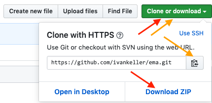
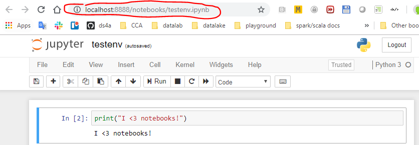

# EMA Cameroun - 2019
École Mathématique Africaine : bases mathématiques de l’intelligence artificielle  
Yaoudé - Cameroun - Juillet 2019 

# Cours/TP: Outils informatiques pour la science des données : Python
Ivan Keller, AXA Belgique

Ce cours, basé sur des exposés associés à des démonstrations et travaux pratiques, 
permettra aux étudiants d’apprendre à utiliser les outils Open Source de la science des données, 
et notamment l’éco-système autour du langage Python.

## 0. Comment "cloner" ce dépot   
Pour obtenir les fichiers de ce dépot (_repository_) par exemple pour modifier les notebooks :  
       
- Si vous n'avez pas `git` installé vous pouvez simplement : 
    1. téléchargez l'archive : cliquer sur le bouton vert "Clone or download" puis "Download ZIP" (flèches rouges) 
    2. décompresser l'archive à l'emplacement de votre choix (double-click sur le fichier .zip)
- Si vous avez `git` :
    1. cliquer sur le bouton vert "Clone or dowmload" et sur l'icône pour copier l'adresse du depot (flèches oranges)
    2. dans un terminal, à l'emplacement de votre choix, exécuter la commande :
    ```
    git clone <coller ici l'adresse du dépot>
    ```
    
Si vous souhaitez installer git :   
    - pour windows : https://gitforwindows.org/ et utiliser le shell `git bash`  
    - pour Mac et Linux : vous êtes assez débrouillard pour trouver :) (c'est facile).

## 1. Installation de Python
Il existe de nombreuses manière d'installer Python. Nous vous recommandons d'installer la distribution Anaconda :

### 1.1 Installation d'Anaconda  
1. Aller sur https://www.anaconda.com/distribution/  
2. Choisir l'instaleur selon votre OS (Windows, Mac ou Linux) et machine (64/32 bits) et choisir la version 3 (3.7 à ce jour).  
3. Suivre les instruction d'installation sur https://conda.io/projects/conda/en/latest/user-guide/install/index.html selon votre système.

Si vous ne bénéficiez pas d'une bonne connection internet vous pouvez installer la version légère de la distribution:  

### 1.2 Alternative: installation de Miniconda3  
1. Aller sur https://conda.io/en/latest/miniconda.html  
2. Télécharger l'installeur pour **Python 3.7** correspondant à votre machine et votre système (64-bit/32-bit et OS).  
3. Suivre les instruction d'installation sur https://conda.io/projects/conda/en/latest/user-guide/install/index.html selon votre système.  

En plus de Python 3, Anaconda et Miniconda installent l'utilitaire `conda` qui est un gestionnaire de paquets et d'environnements (_package and environment manager_) ainsi qu'un environnement de base.  

Si vous avez installé Miniconda, on commencera avec cet environnement de base puis on installera les modules nécessaires à mesure des besoins.

## 2. Exécuter du code Python
Il y a plusieurs manières d'intéragir avec Python:  
1. En session intéractive (python shell, console, REPL): dans un terminal, exécuter la commande **`python`** ou **`ipython`** et ensuite des commandes Python :
    ```
    $ python
    Python 3.7.1 (default, Dec 10 2018, 22:54:23) [MSC v.1915 64 bit (AMD64)] :: Anaconda, Inc. on win32
    Type "help", "copyright", "credits" or "license" for more information.
    >>> print('Hello EMA!')
    Hello EMA!
    >>>
    ```

2. En écrivant du code Python dans un éditeur de texte, par exemple :  
    ```
    # hello_ema.py : un script élémentaire en Python 3

    print("Hello EMA!")
    ```   
    et en demandant à l'interpréteur Python d'exécuter le script : 
    ```
    $ python hello_ema.py
    Hello EMA!
    ```  
3. En mode intéractif dans un _notebook_ (carnet de notes) Jupyter. Un notebook est une application web (un programme avec lequel on intéragit avec un navigateur web) qui permet d'intéragir avec un langage de programmation, dont Python, et d'afficher le résultat de l'exécution de code ainsi que d'ajouter des notes textuelles enrichies (en Markdown comme dans le présent fichier).

    Si vous avez Miniconda vous devez d'abord installer le module `jupyter` :
    ```
    $ conda install jupyter
    ```
    Puis lancer le serveur web de notebooks qui ouvrira une fenêtre dans le navigateur web :  
    ```
    $ jupyter notebook
    ```
     

